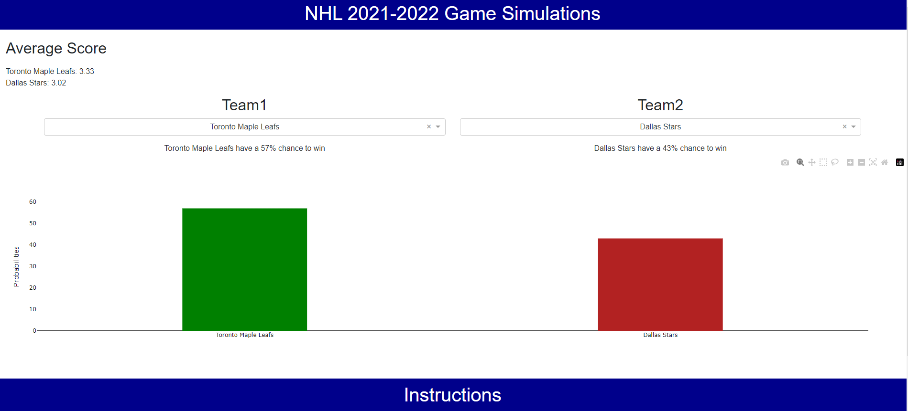

# NHL Monte Carlo Game Simulation Dashboard

## Project Description

The data is from https://www.naturalstattrick.com/ and put through an ETL pipeline to be stored into a PostgreSQL DB name nhlgamesdb. From the nhlgamesdb, dbt (Data Build Tool) is used to build, maintain, and document the analytics data ecosystem. 

Using the data processed through dbt, a Plotly & Dash dashboard app that simulates 100,000 games between any pair of NHL teams to produce the probabilities of each team winning. 

This application can be used to determine playoff series outcomes through regular season stats. The application covers the 2021-2022 NHL season.  

## Methods Used

1) Descriptive Statistics - Used for preliminary data exploration.
2) Monte Carlo Simulationos - Predict series outcomes between teo NHL teams.
  * The simulation method on a per game bais can be defined as follows (team with the highest score wins):
    * Team1: random selection of points for + random selection of opponents points against / 2
    * Team2: random selection of points for + random selection of opponents points against / 2

  

## Predictions Dashboard

<strong>App User Name:</strong> data  <strong>App Password:</strong> analyst  <strong>Note -</strong> the dashboard takes a few seconds to load

* Deployed to Render here: https://nhl-monte-carlo-dash.onrender.com/  

  

## nhlgamesdb Documentation produced with dbt

* Deployed here: https://nhlgamesdb-docs.netlify.app/#!/overview  

  
  

## Technologies 

1) Python 
2) PostgreSQL
3) dbt
5) Microsoft Excel

## Folder & Files & Descriptions

* **NHL_Game_ETL_Pipeline -**  Scarpes data from the web and the NHL API to be put through an ETL process and stored in a PostgreSQL database.
  
  * **Data -** Stores the wrangled data to then be put through an ETL process.
  * **Create_Tables_NHL.py -** Creates a database called nhlgamesdb wtih all needed tables. This file can also be run when the database needs to be rebooted and started from scratch.
  * **SQL_Queries_NHL_Games.py -** A file that contains all the necessary SQL queries for the ETL process.
  * **ETL_NHL.py -** Processes the data in through the ETL pipeline and stored in PostgreSQL and 2nd normal form.
  * **NHLDB_Test.ipynb -** Jupyter Notebook that runs SQL queries to test nhlgamesdb after the data pipeline has been run.

 

* **Analytics_DBT/Analytics -**  The analytics ecosystem managed by bdt (Data Build Tool) technology. By leveraging dbt the analytics data ecosystem can be built, maintained, and documented with every step of the coding process.
  
  * **analyses -** Stores all models used for analyses and doesn;t need to be included in the database.
  * **dbt_packages -** Stores dbt packages.
  * **logs -** Process logs.
  * **macros -** Stores any created dbt macros.
  * **models -** Stores all created data models yo be proccesssed to the nhlgamesdb via schema analytics.
  * **seeds -** Stores any seed tables.
  * **snapshots -** Stores record changes to mutable tables over time.
  * **target -** Contains connection information to the warehouse.
  * **tests -** Stores all generic tests for the dbt project.
  * **All .yml Files -** Any .yml files found in the folders are used for customization of the dbt project (test, refernces, macros, packages, etc.).

     
  
* **Dashboard -**  Stores all Plotly Dash app files. The Dashboard app allows the user to simulate 100,000 games between any pair of NHL teams to produce the probabilities of each team winning.

  * **Data/Create_CSV_Monte_Carlo_Data.py -** Stores the python script that pulls data from the nhlgamesdb to CSV file to be used by the dashboard.
  * **Plotly_Dash_Season_Playoff_Dashboard.py -** Plotly Dash Dashboard app script.
